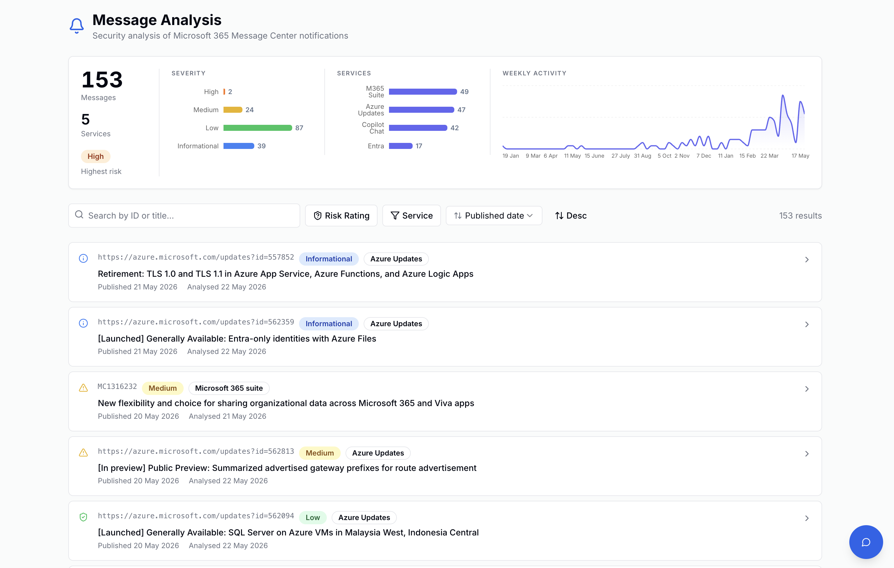
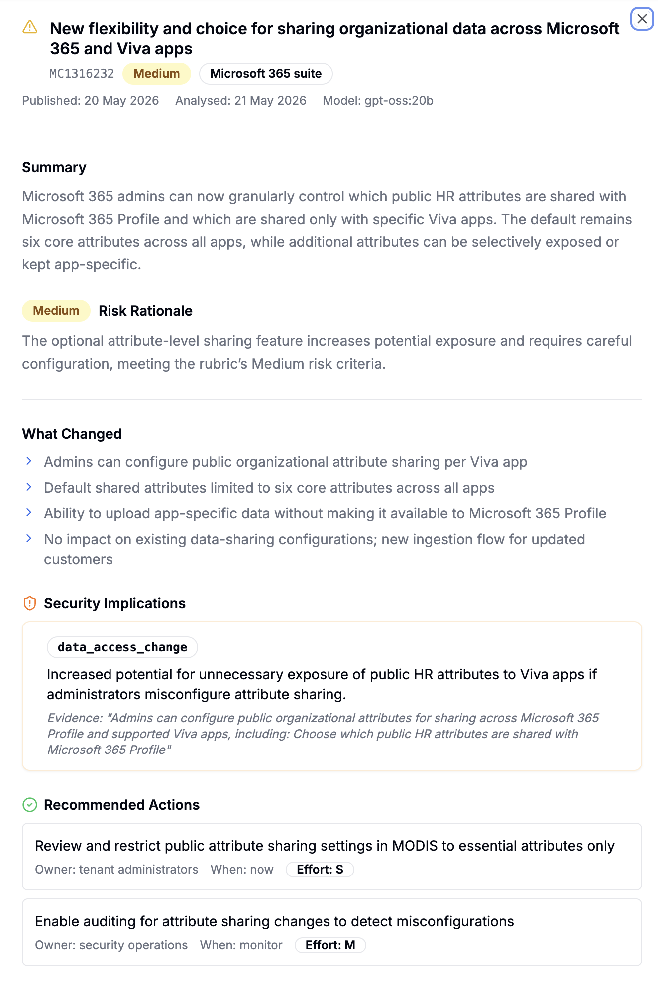

# M365 & Azure Security Triage

This tool is a high-fidelity security triage engine for the Microsoft Cloud. It transforms the overwhelming stream of M365 Message Center posts and Azure Service Updates into actionable security intelligence using local LLMs (Ollama). 

By grounding an AI "Senior Security Architect" in your specific tenant context, it filters out the noise of UI/UX changes and focuses exclusively on material shifts in your security posture.

## Key Standout Features

- **Adversarial Reasoning**: Unlike simple keyword filters, the engine performs an internal "Red Team vs. Blue Team" debate for every update, forcing the model to identify exploit vectors and mitigation strategies before reaching a final risk rating.
- **Hybrid Authentication**: Implements a sophisticated local-first auth model. It utilizes your active **Azure CLI session (`az login`)** for deep Azure resource scanning while maintaining a scoped Service Principal for M365 Graph data.
- **Tenant-Grounded Triage**: The AI is grounded in your actual environment (enabled SKUs, active service usage, and discovered Azure resource types), significantly reducing hallucinations and false positives.
- **Privacy-First**: Designed for high-sensitivity environments. All analysis is performed **locally via Ollama**. Your organizational security guidance and analysis results never leave your infrastructure.

## Core Capabilities
- **M365 Message Center**: Full lifecycle triage of service announcements.
- **Azure Security Intelligence**: Automatically ingests Azure Service Health, Advisor Security recommendations, and filtered Product Updates.
- **Dual-Persistence Architecture**: Seamlessly syncs between a high-speed local Postgres and a shared Neon.tech cloud database.
- **Security Hotspots**: Allows you to define "Security Seed Packs"—custom organizational concerns (e.g., Copilot agentic risks, TFN exfiltration) that steer the AI's focus.

## Headless by Design: Analysis over Presentation

This tool is built for the **heavy lifting** of data collection and automated triage. It is not a visualization platform. By design, it functions as a headless intelligence engine that delivers high-fidelity, structured data (JSONB) into your persistent database.

While the tool provides immediate "push" notifications via Telegram for critical alerts, the broader presentation of the longitudinal data is left to the user's preferred ecosystem.

### Suggested Downstream Visualization
Since all analysis is stored in structured Postgres tables, you can easily layer your own reporting tools on top.

**Example Implementation:**
The following screenshots show a custom internal security portal built using Streamlit that visualizes the high-fidelity triage data generated by this tool:


*A high-level dashboard showing risk trends and categorized security updates.*


*Deep-dive analysis of specific M365 and Azure updates with AI-generated risk ratings.*

- **PowerBI / Tableau**: For executive risk reporting and M365/Azure change trends.
- **Grafana**: For real-time monitoring of security implications and model performance.
- **Streamlit**: For building custom, Python-based internal security dashboards.
- **SIEM Integration**: Forward the filtered, high-risk JSON results directly into Microsoft Sentinel or Splunk for incident response.

## Setup

### 1. Prerequisites
- Python 3.10+
- [PostgreSQL](https://www.postgresql.org/) (Local or [Neon.tech](https://neon.tech/)) for analysis persistence.
- [Ollama](https://ollama.com/) with a capable model:
    - **Recommended**: `llama3.1:70b` or `gpt-oss:20b` (Requires 16GB+ VRAM/RAM for decent performance).
    - **Minimum**: `llama3.2:3b` (Fast, but prone to hallucinations in complex security logic).
- [Azure CLI](https://learn.microsoft.com/en-us/cli/azure/install-azure-cli)

### 2. Configuration
Copy `.env.example` to `.env` and fill in your details.
```bash
cp .env.example .env
```

### 3. Custom Guidance
Create a `guidance.json` file to define your specific security themes. See `guidance.json.example` for the format. This file is ignored by Git.

### 4. Authentication
Run the following to authenticate for Azure resource access:
```bash
az login
```

## Usage
Run the main script:
```bash
python3 msgcenter.py --count 5 --days 30
```

### Arguments
- `--count N`: Number of messages to process (0 for all).
- `--days N`: Lookback window in days.
- `--model NAME`: Specify Ollama model.
- `--force`: Re-analyze even if already in DB.
